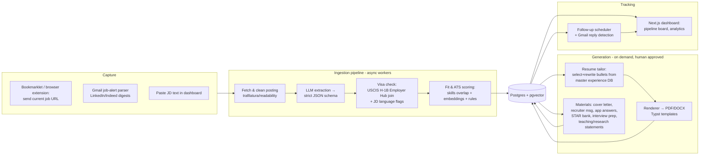

# System 1 — AI Job Search & Application Platform ("JobOps")

## 1. Problem definition

You apply across four distinct role families (SWE/backend/full-stack, AI/Data/ML engineer, web-analytics/industrial data, and teaching/academic). Each family needs a different resume, different keywords, different materials (industry: resume + cover letter + recruiter message; academic: CV + teaching philosophy + research/diversity statements). Manually, each quality application takes 45–90 minutes: read the JD, check visa friendliness, tailor the resume, write the letter, log it in a spreadsheet, remember to follow up. At 10+ applications/day that's unsustainable, so quality collapses or volume collapses.

**The system's job:** turn a job posting URL into (a) a structured, scored, visa-checked job record, and (b) a reviewed-by-you application packet, in under 10 minutes of *your* time, with tracking and follow-ups fully automatic.

## 2. Business / career value

- Direct: more applications × higher per-application quality × better targeting (skip visa-hostile postings early) → more interviews.
- Compounding: response-rate analytics tell you which resume version and which keywords actually work — the system gets smarter about *your* market.
- Portfolio: this is itself a legitimate AI engineering project (LLM extraction, embeddings, ranking, human-in-the-loop generation) you can demo in interviews — with your own data.

## 3. Architecture



### Key design decisions

- **Capture, don't crawl (MVP).** Scraping job boards at scale fights bot detection forever. MVP: you browse as normal; one click sends the URL/text to the pipeline. Gmail job-alert parsing adds semi-automatic discovery. A later phase can add polite API-based discovery (Indeed/Adzuna APIs, university HR RSS, HigherEdJobs email digests for academic roles).
- **LLM extraction into a strict schema** (function-calling / JSON mode), validated with Pydantic. Anything unparseable goes to a review queue instead of corrupting data.
- **Visa intelligence is data + LLM, not LLM alone.** Load the public **USCIS H-1B Employer Data Hub** CSVs (approvals/denials by employer, yearly) into Postgres once per year. Fuzzy-match employer names. The LLM only handles JD language signals ("must be authorized without sponsorship", "US citizens only", "will sponsor"). Output: `sponsors_h1b: likely | unlikely | unknown` + evidence.
- **The resume is a database, not a document.** Master experience store: every job/project as tagged bullet variants. Tailoring = retrieval + selection + bounded rewriting, never invention.

## 4. AI agent design

Not a free-roaming agent — a set of **narrow, tool-shaped agents** invoked by the pipeline or by you. Each has one prompt file, typed inputs/outputs, and eval fixtures.

| Agent | Trigger | Input | Output | Autonomy |
|---|---|---|---|---|
| `jd-extractor` | new posting | cleaned JD text | `JobPosting` JSON (skills, salary, location, remote, visa flags, seniority, role family) | full auto |
| `fit-ranker` | after extraction | JobPosting + profile | fit score 0–100 + rationale + missing skills | full auto |
| `resume-tailor` | you click "Tailor" | JobPosting + bullet DB + base version | selected bullets + rewrites + diff view | **draft → you approve** |
| `ats-checker` | after tailoring | tailored resume + JD | ATS score, keyword coverage table, realistic suggestions | full auto |
| `materials-writer` | you click per artifact | JobPosting + approved resume + your corpus (past letters, statements) | cover letter / recruiter msg / short answers / statements | **draft → you approve** |
| `interview-prep` | status → Interview | JobPosting + company research | likely questions, STAR answers from your bullet DB, technical talking points | full auto |
| `follow-up` | schedule | application record | reminder + drafted follow-up email | draft → you send |

## 5. LLM / RAG architecture

- **Model gateway:** one client (`litellm` or a 50-line wrapper) reading `models.yaml`: `extractor: cheap-fast-model`, `writer: strong-model`, `embedder: text-embedding-small`. Swapping models = editing config.
- **Embeddings & retrieval:** embed (a) every experience bullet, (b) every JD's extracted skill set, (c) your corpus of past cover letters/statements. Retrieval uses pgvector cosine + Postgres FTS hybrid (RRF fusion — ~30 lines of SQL, no framework).
- **ATS score = deterministic + semantic:** `0.6 × exact/normalized keyword coverage (skill taxonomy match) + 0.3 × embedding similarity (JD ↔ resume) + 0.1 × rule checks (section headers, dates, contact info, no tables/images)`. Deterministic parts make the score explainable and stable; the LLM only *explains* gaps and suggests edits.
- **Anti-hallucination rule (hard):** `resume-tailor` may only emit bullets whose `source_bullet_id` exists; rewrites are checked by a verifier prompt ("does the rewrite claim anything the source doesn't?") before display.
- **RAG for statements:** teaching philosophy / research / diversity statements are generated from *your* seed documents (write one honest master version of each once; the system adapts per institution — mission, student body, program focus fetched from the posting/site).

## 6. Database schema (Postgres)

```sql
companies(id, name, normalized_name, website, industry,
          h1b_approvals_3yr, h1b_denials_3yr, everify BOOLEAN,
          visa_verdict TEXT, notes)

jobs(id, company_id, url, title, role_family,          -- swe|ai_ml|analytics|teaching
     source, jd_raw TEXT, jd_clean TEXT,
     skills JSONB, salary_min, salary_max, currency,
     location, remote_type,                            -- onsite|hybrid|remote
     visa_signal TEXT, visa_evidence TEXT,
     seniority, posted_at, deadline,
     fit_score INT, fit_rationale TEXT,
     jd_embedding VECTOR(1536), status, created_at)

experience_bullets(id, org, role, project, bullet_text,
     skills TEXT[], metrics TEXT, role_families TEXT[],
     embedding VECTOR(1536), is_master BOOLEAN, parent_id)

resume_versions(id, name,                              -- swe|ai|data|teaching|academic_cv
     template, bullet_ids INT[], summary_text,
     file_url, is_base BOOLEAN, created_at)

applications(id, job_id, resume_version_id,
     status,        -- captured|triaged|tailoring|ready|applied|screen|interview_1..n|offer|rejected|ghosted|withdrawn
     applied_at, channel,                              -- portal|email|referral|recruiter
     next_follow_up DATE, notes,
     outcome, response_days INT)

materials(id, application_id, kind,                    -- cover_letter|recruiter_msg|answers|teaching_stmt|research_stmt|diversity_stmt|interview_prep
     content TEXT, approved BOOLEAN, file_url, created_at)

contacts(id, company_id, name, role, email, linkedin, notes)

events(id, application_id, kind, payload JSONB, at)     -- audit trail; feeds analytics

references_people(id, name, title, email, relationship,
     last_used_at, notes)                               -- academic reference management
```

## 7. API design (FastAPI, `/api/v1`)

```
POST /jobs                     { url | raw_text }        → queues ingestion, returns job_id
GET  /jobs?status=&family=&min_fit=&visa=likely          → ranked list
GET  /jobs/{id}                                          → full record + score breakdown
POST /jobs/{id}/tailor         { base_version }          → draft resume diff
POST /jobs/{id}/approve-resume { edits }                 → renders PDF/DOCX, stores version
POST /jobs/{id}/materials      { kind }                  → draft material
POST /applications             { job_id, resume_version_id, channel }
PATCH /applications/{id}       { status, notes }
GET  /applications?view=board                            → kanban payload
GET  /analytics/funnel          /analytics/resume-versions  /analytics/response-rate
POST /inbox/scan                                         → parse Gmail for alerts & replies (idempotent)
```

## 8. Frontend pages (Next.js)

1. **Inbox** — newly captured jobs, sorted by fit score; visa badge; one-click triage (pursue/skip).
2. **Job detail** — JD, extraction, score breakdown, keyword gap table, tailor button, materials panel.
3. **Resume studio** — bullet database editor; side-by-side JD ↔ tailored diff; approve → PDF.
4. **Pipeline board** — kanban by status with follow-up due dates surfaced.
5. **Analytics** — funnel (captured→applied→screen→interview→offer), response rate by resume version / role family / visa verdict / source.
6. **Corpus** — master statements, past letters, references list.

## 9. Backend services

- `api` (FastAPI) — CRUD + queue enqueue.
- `worker` — ingestion pipeline steps, LLM calls, rendering (Typst → PDF), Gmail scan. Postgres-backed queue (`FOR UPDATE SKIP LOCKED`); no Celery/Redis needed at this scale.
- `scheduler` — cron in the worker: daily Gmail scan, follow-up reminders, weekly analytics digest, yearly H-1B data refresh.

## 10. Cloud architecture

Docker Compose on one VM (see docs/README.md). S3 for rendered PDFs and raw JD snapshots. Gmail via OAuth (read + draft scopes only — the system never auto-sends). Cost target: < $25/mo + LLM usage (~$5–15/mo with a cheap extractor model).

## 11. Security considerations

- OAuth tokens and API keys in a `.env` on the VM only (or SSM Parameter Store); never in the repo.
- Gmail scope minimization: `gmail.readonly` + `gmail.compose`. **No send scope.**
- Dashboard behind auth (single-user: Caddy basic auth or Clerk) — it contains your PII and application history.
- LLM data hygiene: JDs are public, but your resume/corpus goes to model providers — use providers with no-training API terms; keep the model gateway pluggable to a local model if desired.
- Rate-limit and respect robots/ToS on fetching; the capture-first design keeps you inside normal browsing behavior.

## 12. MVP (weeks 1–3)

1. Schema + bullet DB seeded with your real resume content (one-time structured import).
2. `POST /jobs` with URL/paste → extract → visa check → fit score.
3. Resume tailor with diff view + Typst render for the 4 industry versions + academic CV.
4. Cover letter + recruiter message generation.
5. Application tracking table + kanban + follow-up dates.
6. USCIS H-1B data loaded and joined.

**Explicitly not in MVP:** auto-discovery crawling, auto-submission, Chrome extension (bookmarklet is 20 lines and enough), interview-prep agent, analytics beyond a funnel count.

## 13. Advanced version

- Gmail alert parsing + reply detection → auto status updates (applied→screen→rejected).
- Interview-prep packets and STAR bank auto-built per interview.
- Academic pipeline extras: reference reminders, deadline calendar sync, per-institution statement adaptation.
- Response-rate learning: monthly job that correlates outcomes with keywords/version and proposes bullet-DB improvements.
- Discovery: Adzuna/USAJobs/HigherEdJobs/university RSS ingestion with dedup (URL + title+company fuzzy hash).
- Browser extension with in-page overlay (fit score while you browse).

## 14. Development roadmap

Covered in [05-execution-plan.md](05-execution-plan.md) — System 1 owns weeks 1–5 and is dogfooded from week 2 onward.
