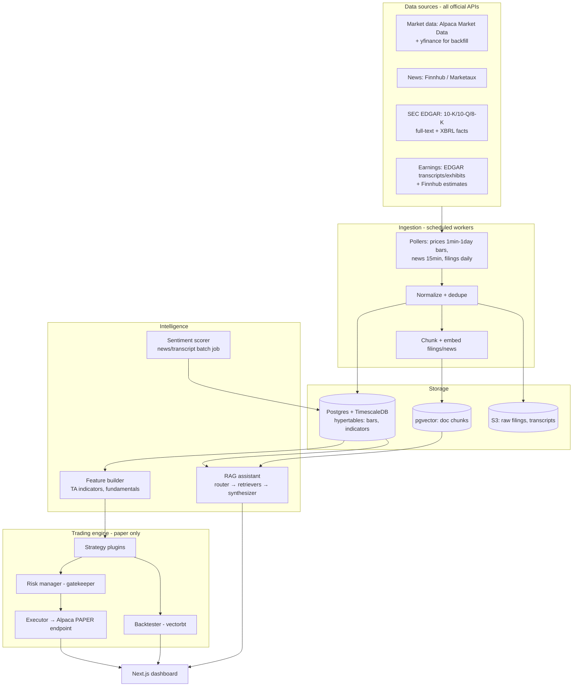

# System 2 — AI Financial Trading Intelligence Platform ("MarketMind")

> **Positioning (be honest with yourself):** this system's primary job is to get you hired as an AI engineer. Its secondary job is paper trading research. Making money with real automated trading is *not* a 90-day goal and is treated as a heavily-gated future phase. Everything is designed to production standards anyway — that's the portfolio signal.

## 1. Problem definition

Retail investors face fragmented information: prices in one app, news in another, SEC filings unreadable, earnings calls unlistened-to. Answering "should I buy NVIDIA?" well requires synthesizing all of them with source attribution and risk framing. Separately, testing trading ideas requires reproducible backtests and disciplined risk management, which spreadsheet-driven retail workflows lack.

## 2. Business / career value

This project demonstrates, in one repo, exactly what AI Engineer JDs list: streaming/batch data pipelines, RAG over heterogeneous documents (filings, news, transcripts), agentic tool use, model evaluation, time-series storage, backtesting, and safety engineering. FinTech is a huge hiring market for it. Demo-ability is excellent: "ask my system about any S&P 500 stock, watch it cite the 10-K."

## 3. Architecture



**Why Alpaca, not Robinhood:** Robinhood has no official public trading API; unofficial clients violate ToS, break silently, and look bad in a portfolio. Alpaca has an official, free, well-documented API with a first-class **paper trading environment** — the exact architecture transfers to live trading later by changing one base URL behind three gates (see §11).

## 4. AI agent design

- **Router agent** — classifies the user question: price/quantitative → SQL tool; narrative/why → RAG retrievers; recommendation → full analysis chain.
- **Analysis chain** (for "Should I buy NVDA?"): runs 4 tool-using steps — fundamentals (XBRL facts), technicals (indicator summary), news+sentiment (last 30d), filings risk factors (10-K Item 1A retrieval) — then a **synthesizer** produces: market summary, bull case, bear case, key risks, scenario table. Every claim carries a citation (filing accession no., article URL, or query result). Output always includes a fixed disclaimer and **never** an imperative "buy/sell" instruction.
- **Sentiment scorer** — batch LLM job labeling news/transcript chunks −1..+1 with rationale; stored, aggregated per ticker per day (a time series feature, not a live LLM call).
- **Strategy agents are NOT LLMs.** Strategies are deterministic Python (momentum, mean-reversion, sentiment-factor). LLMs generate *hypotheses and reports*; they do not place orders. This separation is a headline design point in interviews.

## 5. LLM / RAG architecture

- **Chunking:** filings by item/section (10-K Item 1A, 7, 8) with section metadata; news whole-article; transcripts by speaker turn.
- **Hybrid retrieval:** pgvector + Postgres FTS, filtered by `ticker`, `doc_type`, `date range` *before* similarity (metadata-first filtering is what makes financial RAG accurate).
- **Answer contract:** synthesizer must output JSON `{summary, bull_points[], bear_points[], risks[], scenarios[], citations[]}`; the UI renders it — so faithfulness is checkable.
- **Evaluation harness (a first-class feature):**
  - Golden set: 50 hand-written Q→expected-facts pairs (e.g., "NVDA FY2025 data-center revenue?" → value from the 10-K).
  - Automated checks: citation-must-exist, numeric-claims-must-match-source (regex + XBRL lookup), LLM-as-judge for faithfulness with a *cheap* model.
  - Run in CI on every prompt change; scores tracked in a table → dashboard chart. This is the strongest interview artifact in the whole repo.

## 6. Database schema

```sql
tickers(symbol PK, name, sector, industry, active)
bars(symbol, ts, open, high, low, close, volume, timeframe)      -- Timescale hypertable
indicators(symbol, ts, name, value)                              -- hypertable
fundamentals(symbol, fiscal_period, metric, value, source_accn)  -- from XBRL
documents(id, symbol, doc_type,        -- news|10K|10Q|8K|transcript
          title, url, published_at, accession_no, s3_key)
chunks(id, document_id, section, text, embedding VECTOR(1536), meta JSONB)
sentiment(symbol, date, score, n_docs, method)
strategies(id, name, params JSONB, version, status)
backtests(id, strategy_id, start, end, universe TEXT[],
          metrics JSONB,               -- sharpe, max_dd, cagr, win_rate, turnover
          equity_curve_s3, created_at)
orders(id, strategy_id, symbol, side, qty, type, limit_price,
       status, mode,                   -- paper|live (live locked)
       risk_check JSONB, alpaca_id, ts)
positions(symbol, qty, avg_price, mode, updated_at)
risk_events(id, kind, detail JSONB, action_taken, ts)            -- circuit breaker audit log
qa_evals(id, run_id, question, expected, answer, scores JSONB, model, prompt_version, ts)
```

## 7. API design

```
GET  /tickers/{sym}/overview            → price, fundamentals, sentiment trend
POST /ask                { question }   → structured analysis (SSE streaming)
GET  /documents?symbol=&type=&q=        → filing/news search
POST /strategies         { name, params }
POST /strategies/{id}/backtest { start, end, universe }
GET  /backtests/{id}                    → metrics + equity curve
POST /strategies/{id}/deploy  { mode: "paper" }     -- "live" returns 403 until gates pass
POST /killswitch                        → cancel all orders, flatten, disable strategies
GET  /portfolio          /risk/events   /evals/latest
```

## 8. Frontend pages

1. **Watchlist / ticker overview** — price chart, sentiment sparkline, latest filings & news.
2. **Ask** — chat with streamed structured answer: summary card, bull/bear columns, risk list, citations panel (click → source).
3. **Strategies** — list, params, backtest launcher, equity curve + metrics comparison.
4. **Paper portfolio** — positions, P&L, order log with risk-check verdicts.
5. **Risk & safety** — circuit-breaker status, risk events, global kill switch (big red button).
6. **Eval dashboard** — RAG quality scores over time per prompt version.

## 9. Backend services

`api` (FastAPI, SSE for streaming), `ingester` (scheduled pollers), `analyst` (sentiment + embedding batch jobs), `trader` (strategy scheduler → risk manager → Alpaca paper), all Docker Compose services sharing Postgres.

## 10. Cloud architecture

Same single-VM Compose pattern. TimescaleDB is a Postgres extension — still one database. Market data pollers are lightweight (free-tier API limits: start with a ~30-ticker universe). Optional: GitHub Actions cron for daily filings sync so the pipeline runs even if the VM sleeps.

## 11. Security & safeguards (the section interviewers will read)

**Layered gates before any order:**
1. **Mode lock:** `TRADING_MODE=paper` is an env var; `live` additionally requires a signed config file *and* a per-session manual confirmation. Live code path returns 403 in the MVP — it does not exist yet, deliberately.
2. **Risk manager (deterministic, runs in-process before every order):** max position size (e.g. 5% NAV), max daily loss → halt, max drawdown → flatten + disable, ticker allowlist, order-rate limit, market-hours check, fat-finger check (limit price within 5% of last).
3. **Circuit breakers:** data-staleness breaker (no fresh bars → no orders), volatility breaker, dependency-failure breaker. Every trip logged to `risk_events`.
4. **Kill switch:** one endpoint + dashboard button + CLI: cancel all, flatten all, disable all strategies.
5. **No LLM in the order path.** Ever. LLMs propose, humans and deterministic code dispose.
6. Secrets in env/SSM; Alpaca keys are paper-scope keys; separate keys per environment.
7. Standing disclaimer in UI and README: educational project, not financial advice.

## 12. MVP (weeks 6–8 of the 90-day plan)

Ingest bars+news+filings for ~30 tickers → RAG "Ask" endpoint with citations → sentiment batch job → one momentum strategy + vectorbt backtest → Alpaca paper execution with risk manager + kill switch → dashboard pages 1, 2, 4.

## 13. Advanced version

Earnings-call transcript diffing ("what changed vs last quarter"), sentiment-factor strategy with walk-forward validation, portfolio optimizer (riskfolio-lib), eval dashboard, alerting (price/news triggers → notification), multi-model comparison in evals, and — only after months of stable paper results and gates in §11 — a live-trading design review as its own project.

## 14. Development roadmap

Weeks 6–8 MVP (see [05-execution-plan.md](05-execution-plan.md)); advanced items are backlog, prioritized by demo value: evals dashboard > transcript diffing > optimizer.
