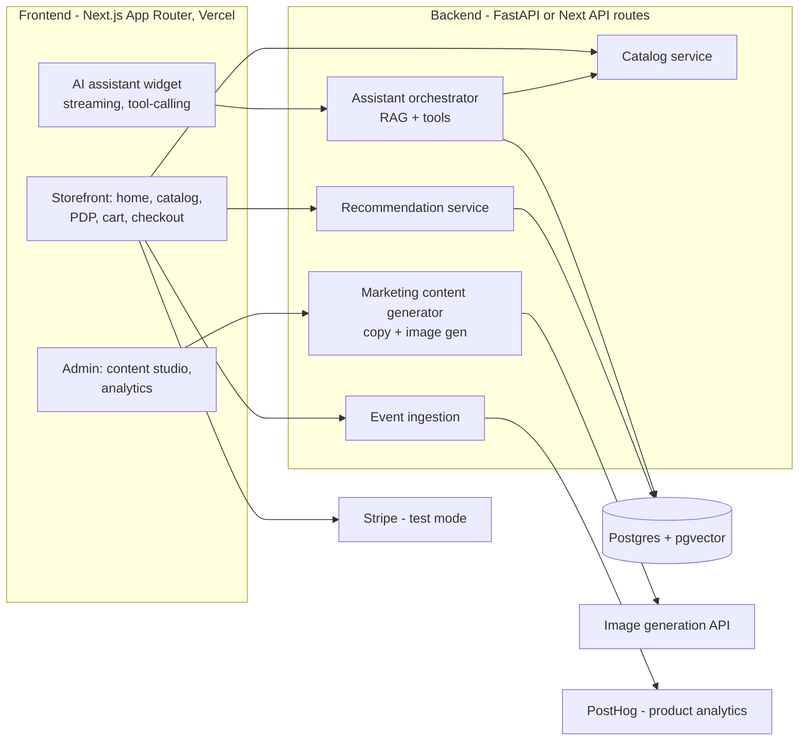

# System 3 — AI-Powered E-commerce Product ("Atelier")

> **Scope discipline:** the internet is full of half-finished AI storefront demos. The differentiator is *polish + one deep AI feature done excellently*, not breadth. This is scoped as a **stretch project (weeks 11–12)** — a single-vertical, visually premium demo store with a genuinely good AI shopping assistant. If time runs short, cut this system entirely before cutting quality on Systems 1–2.

## 1. Problem definition

Demonstrate, in one public deployable product, the combination of: premium front-end craft (the thing most AI-engineer portfolios lack), a production-shaped commerce backend, and applied AI (conversational commerce, recommendations, generated marketing content, behavioral analytics).

## 2. Business / career value

Full-stack roles want to *see* taste and end-to-end ownership. A store that looks like a premium brand (think Aesop/Apple-tier restraint) with an assistant that actually finds the right product is a memorable demo link on a resume — and it exercises Next.js/TypeScript skills that Systems 1–2 use only lightly.

## 3. Architecture



**Single vertical, curated catalog:** ~60 products in one aesthetic niche (e.g. minimal home goods or specialty coffee gear). Small enough to curate quality images/copy; big enough for search and recommendations to be non-trivial.

## 4. AI agent design

- **Shopping assistant** — tool-calling agent with exactly four tools: `search_products(query, filters)`, `get_product(id)`, `compare(ids)`, `add_to_cart(id, qty)`. Grounded strictly in catalog data; refuses to invent specs; answers style questions ("gift for a coffee nerd under $50") via attribute-aware retrieval. Streaming UI with product cards inline in chat — this interaction is the demo's wow moment; invest the polish here.
- **Content studio agent** — admin-side: generates product descriptions in a defined brand voice (voice guide is a versioned prompt file), SEO copy, campaign concepts, and hero/campaign images via an image-gen API; human approves before publish.
- **Recommendation logic — not an LLM.** With no real traffic, collaborative filtering is fake. Honest, effective approach: content-based (pgvector similarity on product embeddings) + rules (same collection, price band, complements) + session-based re-ranking from PostHog events. Documented as such — reviewers respect knowing when *not* to use ML.

## 5. LLM / RAG architecture

Product catalog embedded (title+description+attributes) into pgvector; hybrid search (vector + FTS + attribute filters) behind `search_products`. Assistant prompt enforces: answer only from tool results, cite product IDs, max 2 tool rounds. Cheap fast model — latency matters more than depth here. Eval: 30 golden shopping queries → expected product IDs in top-3 (retrieval hit-rate tracked in CI, same harness pattern as System 2).

## 6. Database schema

```sql
products(id, slug, name, collection, price_cents, currency, stock,
         description, attributes JSONB, brand_voice_copy TEXT,
         images TEXT[], embedding VECTOR(1536), published)
carts(id, session_id, user_id NULL, created_at)
cart_items(cart_id, product_id, qty, price_at_add)
orders(id, cart_id, stripe_session_id, status, total_cents, email, created_at)
users(id, email, name, prefs JSONB)                     -- optional accounts
chat_sessions(id, session_id, started_at)
chat_messages(id, chat_session_id, role, content, tool_calls JSONB, ts)
events(id, session_id, kind, product_id NULL, meta JSONB, ts)  -- mirrored to PostHog
generated_assets(id, product_id NULL, kind, prompt, url, approved, created_at)
```

## 7. API design

```
GET  /products?collection=&q=&sort=        GET /products/{slug}
POST /cart/items      DELETE /cart/items/{id}
POST /checkout                              → Stripe Checkout session (test mode)
POST /assistant/chat  (SSE)                 → streamed assistant turns + tool events
GET  /recommendations?product_id= | session=
POST /admin/content/generate { product_id, kind }      POST /admin/content/{id}/approve
GET  /admin/analytics/summary
```

## 8. Frontend pages

Storefront: home (editorial hero, generated campaign imagery), collection grid, product page (gallery, assistant-aware "ask about this product"), cart drawer, Stripe checkout, order confirmation. Admin: content studio (generate→review→publish), analytics (funnel, assistant conversion, top queries). Design system: 2 typefaces, restrained palette, generous whitespace, real photography-grade imagery only — premium is mostly restraint.

## 9. Backend services

Small enough to run as Next.js API routes + one Python service for embeddings/assistant, or all-FastAPI to reuse System 1/2 patterns. Recommendation: **Next.js on Vercel + FastAPI "brain" on the shared VM** — shows polyglot service design cheaply.

## 10. Cloud architecture

Vercel (frontend, free tier) + shared VM (FastAPI brain) + Neon/Supabase Postgres (free tier) + Stripe test mode + PostHog free tier. Public demo cost ≈ $0.

## 11. Security considerations

Stripe test keys only, webhook signature verification, rate-limit the assistant endpoint (it spends your LLM budget), prompt-injection hygiene (assistant tool results are data, not instructions; no admin tools exposed to the public agent), no real PII collected on the demo, admin routes behind auth.

## 12. MVP

Catalog + PDP + cart + Stripe test checkout + shopping assistant with 4 tools + content-based recommendations + PostHog events. Beautiful ≥ feature-complete.

## 13. Advanced version

Content studio with image generation, session-based re-ranking, A/B testing copy variants, semantic search bar, video hero via gen-video API, multi-language.

## 14. Development roadmap

Weeks 11–12 (stretch) in [05-execution-plan.md](05-execution-plan.md). Hard rule: do not start until System 1 is in daily use and System 2's demo is recorded.
