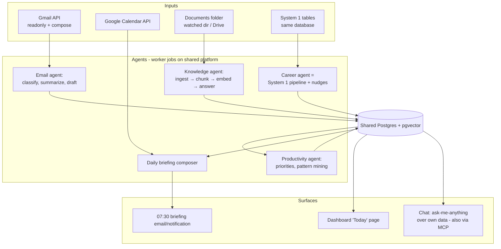

# System 4 — Personal AI Operating System ("Cortex")

> **Architecture decision (from the critical review):** Cortex is not a fourth app. It is the *shell* around System 1 — same repo, same Postgres, same worker/scheduler, same dashboard. The career agent **is** System 1. What Cortex adds: email intelligence, calendar/deadline awareness, a personal knowledge base, and a daily briefing that ties it together. Built as "lite" in ~1 week (weeks 9–10), then grown by usage.

## 1. Problem definition

Your professional state is scattered: Gmail threads (recruiters, applications, university correspondence), calendar (interviews, deadlines), documents (resumes, statements, transcripts, project notes), and tasks living in your head. You spend mental energy on triage and recall — "did that recruiter reply?", "when is the Purdue deadline?", "what did I claim about that Kafka project in my AI resume?" — which is exactly what a retrieval + summarization system does better.

## 2. Business / career value

Direct time savings (30–60 min/day of triage), zero dropped follow-ups/deadlines during a job search where responsiveness is scored, and a personal knowledge base that makes every interview-prep and materials-generation task faster and more consistent.

## 3. Architecture



## 4. AI agent design

| Agent | Schedule | What it does | Autonomy |
|---|---|---|---|
| **Email** | every 30 min | Classify new mail into `recruiter / application-update / academic / action-needed / newsletter / ignore`; extract entities (company, role, deadline, interview time); link to System 1 applications; summarize threads; draft replies for `action-needed` | Classify+link: auto. Replies: **draft only, never send** |
| **Career** | daily | System 1 ingestion + nudges: "3 follow-ups due", "fit-87 posting captured yesterday untriaged", "interview Thu — prep packet ready?" | auto (nudges), generation on demand |
| **Knowledge** | on file change | Ingest resumes, statements, project docs, notes → chunk, embed, index; answer questions with citations ("what metrics did I claim for the fraud-detection project?") | full auto (read-only corpus) |
| **Productivity** | daily + weekly | Build today's priority list from: interviews (calendar) > application deadlines > follow-ups due > triage backlog > project milestones (from 90-day plan doc). Weekly: mine `events` for repetitive manual actions and propose automations as GitHub issues | suggests; you accept |
| **Briefing** | 07:30 daily | One email/page: calendar today, top-5 priorities, email summary (important only), pipeline deltas, deadline warnings ≤7 days | full auto |

**Common agent contract** (same as System 1): one versioned prompt file each, typed JSON output, eval fixtures, model chosen per-agent in `models.yaml` (classification → cheapest model; drafting → strong model).

## 5. LLM / RAG architecture

- **Knowledge base:** one `kb_chunks` table with `source_type` (`resume|statement|project|note|email_thread`) — the same hybrid retrieval (pgvector + FTS + metadata filter) reused from System 1. Answers must cite `source_doc + location`; "I don't have that" is the required behavior on retrieval miss.
- **Email pipeline efficiency:** classification runs on cheap model over subject + first 1,500 chars; only `action-needed`/`recruiter` threads get full-thread summarization by the strong model. Keeps daily LLM cost cents, not dollars.
- **Chat surface doubles as an MCP server:** expose `search_kb`, `get_pipeline`, `get_today` as MCP tools so any MCP client (Claude, or a cheaper model later) can drive Cortex — this is the model-agnostic continuity mechanism in the Operating Manual.

## 6. Database schema (additions to System 1's DB)

```sql
email_threads(id, gmail_thread_id UNIQUE, subject, category, importance INT,
              summary, entities JSONB, application_id NULL, last_msg_at, needs_action BOOL)
email_drafts(id, thread_id, draft_body, gmail_draft_id, status)   -- created|edited|sent_by_user|discarded
kb_documents(id, source_type, title, path_or_url, sha256, updated_at)
kb_chunks(id, document_id, section, text, embedding VECTOR(1536), meta JSONB)
tasks(id, title, due DATE, source,        -- email|application|calendar|manual|agent
      priority INT, status, linked_id, created_at)
briefings(id, date UNIQUE, content_md, sent_at)
automation_suggestions(id, pattern, evidence JSONB, proposal, status)  -- proposed|accepted|rejected|built
```

## 7. API design (additions)

```
GET  /today                        → briefing payload (priorities, calendar, mail, pipeline)
GET  /email/threads?category=&needs_action=true
POST /email/threads/{id}/draft     → LLM draft → saved as real Gmail draft
POST /kb/ask         { question }  → cited answer
POST /kb/reindex
GET  /tasks?due=today   PATCH /tasks/{id}
GET  /suggestions       PATCH /suggestions/{id} { status }
```

## 8. Frontend pages (added to the shared dashboard)

**Today** (default landing: briefing + priorities + needs-action mail), **Mail triage** (categorized threads, summaries, one-click "draft reply" → opens in Gmail drafts), **Ask** (KB chat with citations), **Automations** (suggestion review queue).

## 9. Backend services

No new services — new worker job types (`email_scan`, `kb_ingest`, `briefing`, `pattern_mine`) on the existing worker + scheduler.

## 10. Cloud architecture

Unchanged from the shared platform. Only new external scopes: Google Calendar readonly.

## 11. Security considerations

This system holds your most sensitive data (entire mailbox metadata + summaries). Rules: Gmail **no-send scope** — drafts only, sending is always a human act in Gmail; encrypt VM disk; dashboard auth mandatory; briefing email contains summaries only, no credentials/links to internal endpoints; email content sent to LLM providers is minimized (see §5) and uses no-training API terms; single-user system — no multi-tenant complexity.

## 12. MVP ("Cortex-lite", ~1 week)

Email classification + summaries + linking to applications; KB ingest of your existing corpus + `/kb/ask`; daily briefing; Today page. That's it.

## 13. Advanced version

Reply drafting with your voice profile (few-shot from your sent mail), calendar-aware scheduling suggestions, automation miner, MCP surface, mobile notifications (ntfy.sh), weekly retro report (time allocation, pipeline velocity).

## 14. Development roadmap

Weeks 9–10 in [05-execution-plan.md](05-execution-plan.md); grown continuously afterward because you live in it daily.
