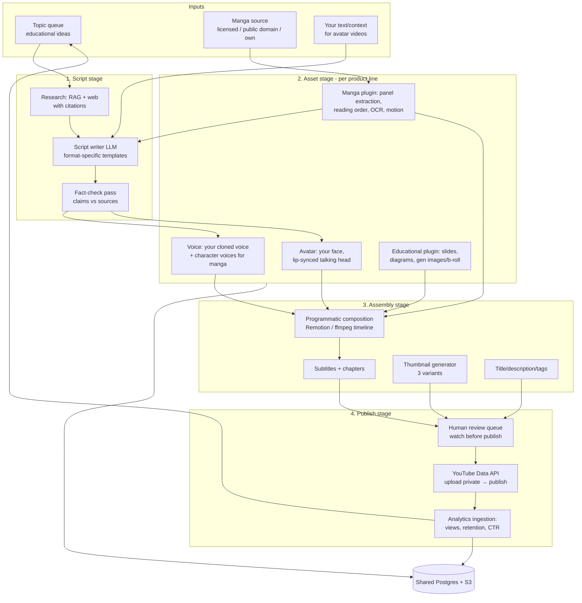

# System 5 — AI YouTube Video Factory ("StudioForge")

> **Positioning:** one pipeline, three product lines. Educational explainer videos, manga narration ("auto-reading manga") videos, and **avatar presenter videos using your own face and cloned voice**. The pipeline stages — script → voice → visuals → assembly → publish → analytics — are shared; each product line is just a different *visual asset plugin*. Build the pipeline once, launch three formats.
>
> **Priority ruling (updates the critical review):** StudioForge **replaces Atelier (System 3) in the stretch slot**. Reasons: (a) a face-forward educational channel compounds your job search — recruiters Google you and find you explaining distributed systems on camera; (b) it has an actual income path (monetization) unlike a demo store; (c) it is itself a stronger AI-engineering portfolio piece (multimodal pipeline: LLM + TTS + vision + lip-sync + rendering). Atelier moves to the backlog.

## 1. Problem definition

Producing one good YouTube video manually takes 6–15 hours: research, scripting, recording, voiceover, editing, thumbnails, metadata, publishing. That cost limits you to sporadic output, and channels grow on *consistent* output. Manga narration videos additionally require panel extraction, reading-order handling, and per-character voicing — pure tedium that is almost entirely automatable. The avatar format removes the biggest personal bottleneck: being camera-ready every time you want to publish.

**The system's job:** turn (a) a topic, (b) a manga chapter, or (c) a text you wrote into a review-ready video draft — script, your cloned voice, visuals, your avatar where wanted, subtitles, thumbnail, metadata — with your role reduced to: approve the script, approve the render, click publish.

## 2. Business / career value

- **Brand:** an educational channel in your own voice/face is the highest-trust portfolio artifact that exists — it demonstrates communication skill, which is the #1 differentiator for senior/teaching roles. Directly reusable evidence for **teaching-track applications** (lecture samples!).
- **Income path:** YouTube monetization + the channel funnels to everything else you do.
- **Portfolio:** a multimodal generation pipeline (LLM scripting, voice cloning, panel CV, lip-sync, programmatic video rendering, YouTube API automation) is a rarer and more impressive repo than another RAG chatbot.

## 3. Architecture



### The three product lines

**A. Educational explainers** (your core channel content)
Topic → researched, cited script in your defined channel voice → your cloned voice narration → visuals: templated Remotion compositions (title cards, code walkthroughs, animated diagrams via Mermaid/Motion Canvas, stock/generated b-roll) → optional avatar intro/outro. Formats: 8–12 min deep dives + 60s Shorts cut from the same script automatically.

**B. Manga narration ("auto-reading manga")**
Chapter pages → **panel segmentation** (Magi / manga-panel-extractor CV models) → **reading-order detection** (right-to-left aware) → **dialogue OCR** (`manga-ocr`) → LLM produces a narration script: scene descriptions + character dialogue attribution → **multi-voice TTS** (narrator = your clone; characters = distinct synthetic voices) → per-panel motion: Ken Burns pan/zoom by default, image-to-video animation for key panels → assembly with page-turn transitions, subtitles, chapter markers.

**C. Avatar presenter videos ("your face, from text")**
One-time setup: record ~3 minutes of clean consent footage + ~10 minutes of voice samples → build your **voice clone** (ElevenLabs professional clone or XTTS-v2 self-hosted) and **avatar** (HeyGen/Higgsfield-style API avatar, or self-hosted lip-sync: audio → LatentSync/SadTalker over your footage). Then: any text you provide → script polish pass (keeps your intent, fixes spoken-word flow) → cloned-voice audio → lip-synced avatar render → composed with slides/b-roll behind/beside you.

> **Build vs buy:** MVP uses managed APIs (ElevenLabs voice, HeyGen or the Higgsfield MCP tools already connected to your environment for avatar/video/voice generation) — pipeline first, cost optimization later. Self-hosted models (XTTS, LatentSync, AnimateDiff) are a phase-2 swap behind the same asset-plugin interface, exactly like the LLM model gateway.

## 4. AI agent design

| Agent | Input | Output | Autonomy |
|---|---|---|---|
| `topic-scout` | channel analytics + your interest list | ranked topic proposals w/ rationale | suggests weekly |
| `researcher` | approved topic | fact sheet with source citations | full auto |
| `script-writer` | fact sheet / manga scene data / your text | timed script (VO lines, visual cues, avatar segments) in channel-voice | **draft → you approve** (hard gate) |
| `fact-checker` | script + sources | flags unsupported claims | full auto, blocks render on fail |
| `manga-analyst` | chapter pages | panels + reading order + OCR text + character map | auto, review queue for low-confidence pages |
| `visual-director` | approved script | shot list: which template/asset per line | auto |
| `assembler` | assets + shot list | rendered MP4 + subtitles + chapters | full auto |
| `packager` | video + script | 3 titles, description, tags, 3 thumbnails | draft → you pick |
| `analyst` | YouTube Analytics API | retention/CTR report; feeds `topic-scout` | full auto |

Same platform contract as every other system: one prompt file per agent, typed JSON I/O, eval fixtures, `models.yaml` tiering (scripting → strong model; metadata/OCR cleanup → cheap model).

## 5. LLM / RAG architecture

- **Channel voice profile:** a versioned prompt asset built from transcripts of videos/writing you like plus your own samples — every script is generated *in that voice*, so output is consistent and sounds like you, not like an AI content mill.
- **Research RAG:** reuses the Cortex hybrid-retrieval stack over a per-video source bundle (docs, papers, official docs you feed it) — scripts may only assert what's in sources; `fact-checker` enforces citation coverage exactly like MarketMind's answer contract.
- **Manga understanding:** vision-capable LLM gets panel crops + OCR text to produce scene descriptions and dialogue attribution; a character registry (name → visual description → assigned TTS voice) keeps voices consistent across a series.
- **Script format is structured data, not prose:** `[{t, kind: vo|avatar|panel|slide, text, visual_ref, voice_id}]` — this is what makes assembly deterministic and the whole pipeline testable.
- **Evals:** golden fixtures for script quality (structure validity, reading level, banned-phrase list, duration estimate accuracy), OCR/panel-order accuracy on a labeled chapter, and TTS pronunciation dictionary tests.

## 6. Database schema (additions to the shared platform DB)

```sql
channels(id, yt_channel_id, name, voice_profile_prompt_id, niche)
topics(id, channel_id, title, rationale, score, status,      -- proposed|approved|scripted|published|rejected
       source_analytics JSONB)
videos(id, channel_id, product_line,                          -- educational|manga|avatar
       topic_id NULL, title, status,                          -- scripting|assets|rendering|review|published|failed
       yt_video_id NULL, duration_s, published_at)
scripts(id, video_id, version, segments JSONB,                -- the structured script format
        approved BOOLEAN, fact_check JSONB)
assets(id, video_id, kind,                                    -- tts_audio|avatar_clip|panel_motion|slide|broll|thumbnail
       s3_key, meta JSONB, cost_cents, provider, status)
manga_series(id, title, rights_basis,                         -- owned|licensed|public_domain|commentary
             character_map JSONB, style_notes)
manga_chapters(id, series_id, number, source_s3_prefix, panel_data JSONB)
renders(id, video_id, s3_key, resolution, render_log, created_at)
publish_jobs(id, video_id, visibility, scheduled_at, yt_response JSONB)
video_analytics(video_id, date, views, watch_time_min, avg_view_pct,
                ctr, subs_gained, revenue_cents)
voice_assets(id, kind,                                        -- my_clone|character
             provider, provider_voice_id, sample_s3, consent_doc_s3)
```

## 7. API design

```
POST /topics                     { title | auto }        GET /topics?status=proposed
POST /videos                     { product_line, topic_id | text | chapter_id }
GET  /videos/{id}                → status, script, assets, cost so far
POST /videos/{id}/script/approve { edits }               → unlocks asset stage
POST /videos/{id}/render
GET  /videos/{id}/preview        → streamable draft render
POST /videos/{id}/publish        { visibility, schedule } → YouTube upload (private first)
POST /manga/chapters             { series_id, pages[] }   → runs manga-analyst
GET  /manga/chapters/{id}/panels → review/correct panel order & attribution
GET  /analytics/channel          /analytics/videos/{id}
GET  /costs?month=               → per-video and per-provider spend
```

## 8. Frontend pages (added to shared dashboard)

1. **Production board** — kanban: idea → script → assets → render → review → published; cost badge per card.
2. **Script review** — side-by-side structured script + source citations; inline edit; approve gate.
3. **Manga workbench** — page viewer with detected panel boxes and reading order (drag to fix), character-voice assignments.
4. **Preview & publish** — draft player, thumbnail A/B picker, title/description editor, schedule.
5. **Channel analytics** — retention curves, CTR, topic performance → feeds topic-scout.

## 9. Backend services

New worker job types on the shared platform (`script_gen`, `tts_render`, `avatar_render`, `panel_extract`, `video_assemble`, `yt_publish`, `yt_analytics_sync`) plus one new component: a **render node** — the only piece that needs real CPU/GPU. Remotion/ffmpeg assembly runs on CPU (fine on the VM); self-hosted lip-sync/animation (phase 2) runs on a **spot GPU instance or Modal/RunPod job** spun up per render, not an always-on GPU.

## 10. Cloud architecture

Shared VM for API/workers; S3 for all media (raw footage, assets, renders — lifecycle rule: drafts expire after 30 days); managed APIs for voice/avatar in MVP; per-render serverless GPU later. YouTube Data API quota (default 10k units/day ≈ 6 uploads) is fine. **Cost envelope MVP:** ~$5–15/video (TTS + avatar minutes + LLM); tracked per-asset in the `assets.cost_cents` column and surfaced on the production board — cost visibility is a feature.

## 11. Security, rights, and policy (read this section twice)

1. **Manga copyright is the #1 risk to the channel.** Narrating someone else's manga with their artwork is *not* automatically fair use, and manga publishers (Shueisha etc.) actively strike recap channels. The schema forces a `rights_basis` on every series and the pipeline **refuses to render** `rights_basis = none`. Safe lanes, in order: (a) **your own AI-generated original manga** (also a better differentiator — you own everything), (b) public-domain works, (c) licensed/indie manga with written permission, (d) true commentary/analysis format where panels are limited, transformed, and critiqued — and you accept residual risk. Grow the channel's *other* formats first; don't build the brand on a strikeable foundation.
2. **YouTube inauthentic-content policy:** mass-produced, low-transformation AI content is demonetizable. Your mitigations are structural: your real cloned voice + your real face + human-approved scripts + original visuals = "AI-assisted", not "AI slop". Always set YouTube's **altered/synthetic content disclosure** flag on avatar videos.
3. **Face/voice cloning governance:** clone only *you*; store a signed consent/usage note with the voice asset (`consent_doc_s3`); provider accounts under your control with 2FA; **never** expose the clone via any public endpoint; character voices for manga must be synthetic stock voices, never cloned real people.
4. **Publish gate is human, permanently.** Uploads go up `private`; a human watches the preview and clicks publish (automation ladder level 2, capped — same policy class as email-send and live trading).
5. Fact-checker blocks render on unsupported claims — an educational channel's asset is trust.
6. YouTube OAuth tokens with upload scope only, on the VM; API keys per provider; spend alerts at $50/month.

## 12. MVP (2 weeks, stretch slot)

Week 1 — avatar + educational line: voice clone + avatar set up (managed APIs); text → script (approve) → cloned VO → avatar render → Remotion assembly with slide templates → subtitles → private YouTube upload. **Ship one real video end-to-end.**
Week 2 — production board + packager (titles/thumbnails/metadata) + analytics sync + Shorts auto-cut. Publish 2 more videos.
**Manga line is post-MVP** (phase 2): panel extraction + workbench + multi-voice, starting with an original/public-domain series.

## 13. Advanced version

Manga line at full quality (image-to-video animated key panels, character-consistent voices), self-hosted TTS/lip-sync behind the asset-plugin interface to cut per-video cost toward ~$1, retention-curve-driven script feedback ("viewers drop at minute 4 — shorten cold opens"), multi-language dubbing (your clone speaking Hindi/Japanese — huge reach multiplier), series planning agent, community-tab post generation, and cross-posting cutdowns (Shorts/Reels/TikTok) from one master timeline.

## 14. Development roadmap

Enters the plan at **weeks 11–12** (replacing Atelier — see updated [05-execution-plan.md](05-execution-plan.md)); steady state afterward: **one educational/avatar video per week at ~2 hours of your time** (topic pick 10 min, script review 30 min, preview review 20 min, publish 5 min — the pipeline does the rest), manga line spun up only once the rights question is settled per §11.
