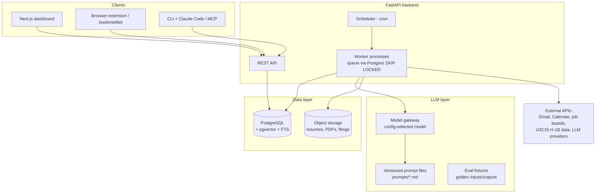

# Personal AI Operating System — Architecture Blueprint

**Owner:** Rahul Ubale · Software Engineer (Java/Spring Boot, React/Next.js, Python, AWS, K8s, data & AI)
**Goal:** Reduce manual work, increase job-search throughput and quality, and produce portfolio projects that get interviews.

---

## The critical review comes FIRST

You asked for four systems. Before designing them, here is the honest architectural review, because it changes the design of everything below.

### Verdict per system

| System | Career ROI | Time saved | Build cost | Verdict |
|---|---|---|---|---|
| 1. Job Search Automation | **Very high** — directly produces interviews | **Very high** (hours/day) | Medium | **Build first. This is the product.** |
| 4. Personal AI OS | High — but 70% of its value *is* System 1 | High | Low if scoped | **Merge into System 1's platform. Build "lite" version.** |
| 2. Trading Intelligence | High as a *portfolio piece* (RAG + pipelines + evaluation are exactly what AI Engineer JDs ask for) | None | High | **Build as portfolio project #1, paper-trading only. Real money is out of scope for 90 days.** |
| 3. AI E-commerce | Medium — full-stack + AI demo, but the market is flooded with AI storefront demos | None | Medium | **Optional / stretch. Build only a tightly-scoped polished demo, or skip.** |

### Complexity removed (decisions already made — don't relitigate them daily)

1. **One platform, not four apps.** Systems 1 and 4 share a single monorepo, database, auth, and dashboard. The "Personal AI OS" is the shell; job search is its flagship module. Systems 2 and 3 are separate public portfolio repos.
2. **One database: PostgreSQL + `pgvector`.** No Pinecone, no Mongo, no Redis-as-a-database, no separate vector store. Postgres does relational data, vectors, full-text search, and job queues (via `SKIP LOCKED`). You can add specialized stores later; you will probably never need to.
3. **One backend language for AI work: Python (FastAPI).** You know Java, but the AI ecosystem (embeddings, evals, backtesting, LangGraph-style orchestration) is Python-native. Java/Spring stays on your resume via existing experience; don't pay a tax re-implementing AI tooling in it.
4. **One frontend: Next.js + TypeScript + Tailwind + shadcn/ui** across all systems. Reuse components between dashboards.
5. **No Kubernetes for personal infra.** You already have K8s on your resume. Personal systems run on Docker Compose on one small VM (or Fly.io/Railway). K8s here is pure cost with zero signal.
6. **Model-agnostic LLM layer from day one.** All prompts live in versioned files, all LLM calls go through one thin client with a config-selected model. This is what lets a cheaper model maintain the system later (see the Operating Manual).
7. **Human-in-the-loop is a feature, not a compromise.** Auto-*generate*, human-*approve*, auto-*track*. Fully automated job applications get accounts flagged and produce garbage applications; fully automated trading with real money is a way to lose money while job hunting. Both are explicitly out of MVP scope.
8. **Robinhood is out.** It has no official public API; scraping/unofficial clients violate ToS and break constantly. **Alpaca** provides a free official paper-trading API — better engineering signal anyway.

### Can one engineer build this?

Yes, **if** the priority order is respected: System 1 MVP is ~2–3 weeks of focused work using managed APIs. System 2 MVP is ~3 weeks. System 4-lite is ~1 week on top of System 1's platform. System 3 is a 2-week stretch goal. The 90-day plan (doc 05) sequences this with job applications running *throughout* — the tool is dogfooded from week 2.

---

## Document index

| Doc | Contents |
|---|---|
| [01-job-search-platform.md](01-job-search-platform.md) | System 1: job ingestion, ATS scoring, resume tailoring, materials generation, tracking dashboard |
| [02-trading-intelligence.md](02-trading-intelligence.md) | System 2: market data pipeline, financial RAG, paper-trading engine, safeguards |
| [03-ecommerce-ai.md](03-ecommerce-ai.md) | System 3: scoped premium AI storefront demo |
| [04-personal-ai-os.md](04-personal-ai-os.md) | System 4: email/calendar/knowledge/productivity agents on the shared platform |
| [05-execution-plan.md](05-execution-plan.md) | 90-day plan, weekly milestones, repo & documentation structure |
| [06-operating-manual.md](06-operating-manual.md) | Daily usage, prompt library, maintenance, cheap-model continuity plan |

## Shared platform stack (used by Systems 1 & 4)

**Deployment:** one VM (e.g. EC2 t3.medium or Hetzner) running Docker Compose: `api`, `worker`, `web`, `postgres`, `caddy` (TLS). Backups: nightly `pg_dump` to S3. That's the whole ops story.
